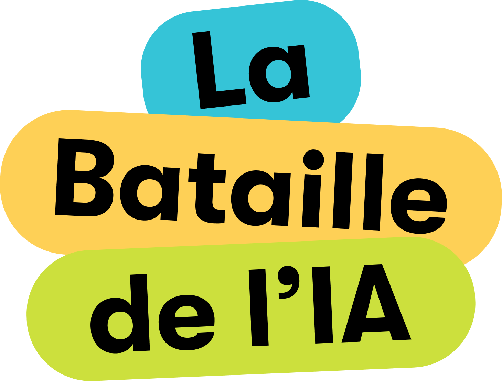

## Mon positionnement vis-à-vis de l'IA

Après un parcours d'abord hésitant puis résistant, j'ai finalement intégré certains outils d'IA dans ma pratique professionnelle. Au-delà de l'effet de mode et des explications techniques qui les réduisent à de simples applications de machine learning, ces technologies représentent un tournant majeur pour l'humanité.

J'aborde l'IA avec responsabilité, cherchant à anticiper son évolution pour éviter ses pièges tout en saisissant ses opportunités. Mon expérience avec un éditeur de code avec un agent IA embarqué a transformé ma façon de travailler - comme un paysan découvrant le tracteur - me donnant des capacités nouvelles mais créant aussi une forme de dépendance que je n'avais pas anticipée.

Cette puissance technique a accéléré mes projets mais a aussi créé un sentiment paradoxal de vide, comme si la facilité de réalisation diluait le sens de l'accomplissement. La question n'est plus tant technique que philosophique et éthique.

Je ne rejette pas l'IA, car son existence est désormais incontournable. Tout en reconnaissant ses implications écologiques et sociales, je préfère contribuer à définir une utilisation responsable plutôt que de simplement m'y opposer. Ce que je propose, c'est une "hygiène de l'IA" permettant d'en tirer le meilleur tout en se préservant de ses écueils.

## Mes expériences

- **Développement web assisté par un agent IA** — Intégration des outils d'IA dans mes projets de programmation avec une réfexion et un usage poussé de l'ingénieurie de contexte
- **Mise en oeuvre de modèle** — Usage avancé de modèle de NLP, LLM et d'embedding au sein de cas d'usages concrets. Utilisation de bases de données vectorielles
- **Médiation numérique** — Dés fin 2022, animation d'ateliers de sensibilisation et formation sur l'IA auprès de publics variés (adolescents, seniors, étudiants, entrepreneurs)
- **Élaboration de cadres d'usage** — Définition de règlements intérieurs encadrant l'utilisation de l'IA dans plusieurs structures
- **Veille active** — Participation aux animations inter-animateurs de "Cafés IA" du Conseil National du Numérique et suivi canaux de veille spécialisés.
- **Conception de prompts spécialisés** — Création de bibliothèques de prompts adaptés à différents contextes et besoins

## Mes propositions d'accompagnement

Forte de mon intérêt pour l'intelligence artificielle et de mon expérience en médiation numérique auprès de publics variés , je propose plusieurs formats d'accompagnement :

- **[Animation de Cafés IA](https://cafeia.org/)** : Sessions de sensibilisation selon le format développé par le Conseil National du Numérique - espaces d'échange informels et accessibles permettant le partage de connaissances sur l'IA.
- **[Bataille de l'IA](https://www.batailledelia.org/)** : Un jeu de cartes pour explorer les enjeux sociaux et environnementaux de l'IA Générative en 2h – imaginé par les associations Latitudes et Data for Good.
- **Ateliers collaboratifs pour l'élaboration de règlements intérieurs IA** : Démarche structurée partant des préoccupations et pratiques existantes pour définir collectivement un cadre d'utilisation responsable, limitant les usages non déclarés potentiellement préjudiciables.
- **Accompagnement personnalisé** : Adaptation aux besoins spécifiques exprimés par votre organisation pour intégrer (ou pas) l'IA de façon réfléchie.

## Contactez-moi

<form
  action="https://formspree.io/f/mjkbnlaz"
  method="POST"
>
  <label for="email" class="block font-medium leading-6 ">Votre email : </label>
  

    <input id="email" name="email" type="email" autocomplete="email" class="block w-full rounded-md border-0 py-1.5 text-gray-900 shadow-sm ring-1 ring-inset ring-gray-300 placeholder:text-gray-400 focus:ring-2 focus:ring-inset focus:ring-indigo-600 sm:text-sm sm:leading-6">
  

  

    <label for="message" class="block leading-6 ">Votre message</label>
    

      <textarea id="message" name="message" rows="3" class="block w-full rounded-md border-0 py-1.5 text-gray-900 shadow-sm ring-1 ring-inset ring-gray-300 placeholder:text-gray-400 focus:ring-2 focus:ring-inset focus:ring-indigo-600 sm:text-sm sm:leading-6"></textarea>
    

  

  

    <button type="submit"  class="rounded-md px-3 py-2 text-sm font-semibold text-black dark:text-white shadow-sm  focus-visible:outline focus-visible:outline-2 focus-visible:outline-offset-2 hover:bg-black/5 hover:dark:bg-white/10 border-black/15 dark:border-white/20 transition-colors duration-300 ease-in-out border">Envoyer</button>
  

</form>

## Les Café IA

Café IA est une plateforme collaborative d'apprentissage portée par le [conseil national du numérique](https://cnnumerique.fr/), qui favorise la mise en commun des réflexions autour de l'intelligence artificielle. Chaque Café IA peut prendre des formes très variées selon vos besoins et vos objectifs, offrant ainsi une grande liberté d'adaptation à votre contexte spécifique. Animer un Café IA au sein de votre structure, c'est créer un parcours en trois temps : d'abord un espace d'écoute et de dialogue pour favoriser les échanges, puis un moment de sensibilisation pour démystifier les réalités et enjeux de l'IA, et enfin une phase d'action collective visant à structurer un positionnement partagé, souvent matérialisé par l'ébauche d'un règlement intérieur. Cette démarche reste accessible à tous : informelle dans son approche, simple à mettre en œuvre et gratuite pour les participants

[Découvrez les ressources des Café IA ↗](https://cafeia.org/)

## La bataille de l'IA

La Bataille de l'IA est un jeu de cartes participatif développé par les associations Latitudes et Data for Good, conçu pour explorer de manière ludique les enjeux sociaux et environnementaux de l'intelligence artificielle générative en deux heures d'atelier. Cette approche pédagogique collaborative permet d'aborder cinq thématiques essentielles - fiabilité de l'information, société et données personnelles, créativité et propriété intellectuelle, biais algorithmiques, et impact environnemental - à travers trois temps forts : la découverte des faits marquants de l'IA sur une frise chronologique, des débats en petits groupes sur les enjeux sociétaux, et enfin des scénarios prospectifs invitant à une réflexion collective sur l'avenir de l'IA. Cet outil de sensibilisation, basé sur des sources fiables et déjà testé auprès de plus de 3000 personnes, favorise l'esprit critique et le dialogue tout en restant accessible grâce à un réseau d'animateurs formés présents sur l'ensemble du territoire.

[Découvrir La Bataille de l'IA ↗](https://www.batailledelia.org/)

## Guide pour un bon usage des chatbots utilisant l'intelligence artificielle

Dans le cadre de mes ateliers de sensibilisation aux usages émergents de l'IA, j'ai élaboré un fanzine accessible compilant les principaux enseignements tirés de mon expérience.
Ce document synthétique propose un aperçu des concepts clés et applications pratiques des chatbots utilisant l'intelligence artificielle. Veuillez noter que sa dernière date de mise à jour, certaines informations pourraient nécessiter une actualisation.
Je reste disponible pour adapter ce contenu en fonction des évolutions technologiques récentes si cela présente un intérêt pour vos équipes.

[Le fanzine dans sa version imprimable](/Fanzine-IA-version-imprimable.pdf)

<iframe src="/Fanzine-IA-version-non-imprimable.pdf" width="100%" height="600px"></iframe>
