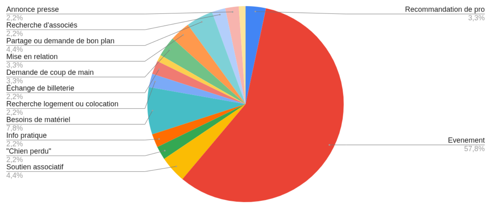
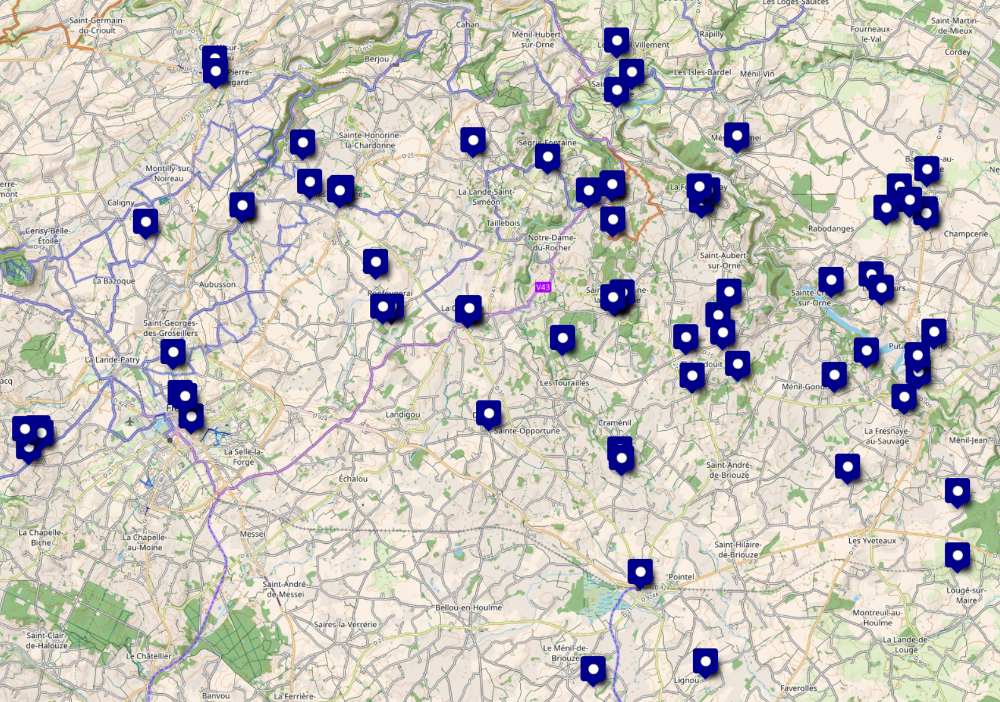

Cet article examine l'émergence et l'impact d'un groupe de messagerie instantanée local dans une campagne ornaise. Créé en 2020, ce groupe Signal (initialement sur WhatsApp) compte 568 membres au moment de la publication de cet article et est devenu un outil essentiel de communication locale malgré l'apparente désertification des villages. Après trois années où, en tant que médiatrice investie sur les enjeux de fracture numérique, je partage ici ce que j’ai compris sur ce réseau informel et ses dérivés thématiques qui facilitent le partage d'événements, petites annonces, et demandes d'entraide.

Je partage ici mon analyse du phénomène. Je vais essayer de présenter les forces de ce système (simplicité, accessibilité, confiance) mais aussi ses limites croissantes dues à son succès (modération, perte d'intimité, surcharge informationnelle, exclusion involontaire).

---

J’habite dans le bocage ornais entre Briouze, Flers et Argentan. Ce territoire est maillé par des petits villages ou hameaux tous les 2 ou 4 km. La plupart des commerces des petits villages ont fermé à quelques exceptions, l’affichage public a disparu, les rues sont désertes. Si quelqu’un passait dans le coin par hasard, il se dirait que cette campagne est morte, qu’il ne s’y passe rien, que c’est une maison de retraite géante, sur plusieurs kilomètres carrés.

Il y avait bien les activités traditionnelles comme le Méchoui de la Forêt Auvray, les après-midi belote à la salle des fêtes, mais le Covid a mis un coup d'arrêt à ces activités. Si les habitants savent très bien entretenir ces dynamiques, il est beaucoup plus délicat de savoir les lancer. De l’avis des anciens Le Covid a clairement fait beaucoup de mal à l'activité locale.

Pourtant je crois qu’on peut dire que notre campagne est plutôt dynamique. En tout cas c’est mon point de vue. Car même si je suis une néo-rurale, j’ai accès à un outil d’information qui me connecte et qui me maille aux initiatives et activités locales : je suis sur “Les Voisins du Bocage”.

# L’agitation silencieuse des groupes de messagerie instantanée locaux

Les Voisins du Bocage, c’est un groupe de messagerie instantanée locale sur Signal (originellement sur Whatsapp) qui est né en 2020 et qui compte à la date de publication de cet article 568 membres. Il a été créé par une contributrice de l’auberge participative El Capitan, pour les voisins de l’auberge afin de les prévenir des activités auxquelles ils étaient conviés. Il comptait à l’origine une trentaine de membres.
Le groupe s’est élargi à d’autres communautés et à de nombreuses personnes pas toujours conscientes de son origine, ce qui a conduit certaines d’entre elles - chose cocasse - à demander aux contributeurs de l’auberge d'arrêter de s’étendre sur leurs actus au sein de ce groupe.

Il est intéressant de noter que cette histoire est arrivée dans d’autres lieux avec les mêmes problématiques et parfois des réponses différentes. J’entends pas là, l’histoire d’un groupe de messagerie instantanée à destination des voisins d’un lieu de vie (ici, l’auberge, ailleurs, un tiers-lieux, un centre social..) qui s’étend à toute une zone géographique et dont l’origine se perd.
J’ai passé 3 ans à suivre presque l’intégralité des échanges de ce groupe pour étudier ce phénomène dans le cadre de mon activité de médiation numérique locale. J’ai discuté avec des membres de groupes similaires dans d’autres régions, j’ai fait quelques statistiques, j’ai une grande bibliothèque de screenshots. Il est difficile de retracer son histoire exacte car le canal ne partage pas beaucoup de métadonnées (comme sa date de création) et a été pensé pour être amnésique à 1 mois.
Je regrette que ce phénomène n'ait pas suscité plus d'intérêt et qu’il n’ait pas été davantage étudié car chez nous il est devenu assez structurant en termes de communication.

En Novembre 2023, il y avait 100 à 120 messages signifiants (que j’ai triés à la main entre blabla et “signifiants”) par mois. Voici les statistiques de l’époque sur les types de message :

On voit que le canal est beaucoup utilisé pour communiquer sur de l'événementiel local, partager des petites annonces et demander des coups de main. Ce n'est pas visible sur ce diagramme mais il y a aussi un usage important pour le relai d’informations immédiates. Les notifications s’emballent par exemple quand un avion dépasse le mur du son ou à l’occasion d’une aurore boréale.

Dans les Voisins du Bocage ou ailleurs, à chaque fois qu’un sujet prenait trop de place, une personne prenait l’initiative de créer un canal dédié. C’est ainsi que sont nés l’Agora du Foin pour canaliser les sujets politiques ou philosophiques, Dons dans le Bocage, Bébés du Bocage, Covoiturage du Bocage, Tuture en partage, Jardin Naturel du Bocage, Travaux du Bocage, Bal folk dans le Bocage, Télétravail dans le Bocage, Animaux dans le Bocage et j’en oublie certainement. En d’autres endroits plus urbains, je sais aussi que ces groupes ont du succès pour signaler les contrôles de police.

Je pense que ce qui plaît dans ce mode de communication est sa simplicité et donc son accessibilité ainsi que sa grande “hackabilité” (dans le sens ou l’on peut créer des nouveaux usages inattendus avec les fonctionnalités existantes). Il n’y a pas beaucoup de concepts à comprendre : une conversation privée et une conversation de groupe, un message et des émojis. En tout cas, dans notre contexte, nous n’utilisons pas d’autres fonctionnalités et la plupart des gens passent à côté des subtilités de Signal. C’est un peu la préhistoire du réseau social et pourtant on y fait du covoiturage, on y cherche des compétences, on y fait son marché.. Le tout dans un contexte de confiance car la plupart des gens se connaissent.

# Victimes de leur succès : les limitations observées

Bien que je trouve que l'écosystème des canaux de communication des Voisins du Bocage particulièrement balèze et résistant pour naviguer dans cette complexité (500 personnes à l’expérience numérique variée sur un même canal cela peut devenir un sacré bazar!) sans gouvernance établie depuis aussi longtemps, ces groupes de messagerie instantanée ont des limites auxquelles nous nous frottons régulièrement.

## La modération

La première de toutes est la modération et son lot de questionnements sur la gouvernance d’un commun informationnel.
Les groupes de messagerie instantanée sont des véhicules privilégiés pour les informations douteuses, les charlatans, les exploiteurs de misère voire carrément la désinformation. On le comprend très bien car du fait de son caractère privé, on y trouve une intimité qui crée un terrain favorable à la confiance. Il est aussi plus dur de s’opposer à un comportement douteux au sein d’un groupe d'individus qui se connaissent que sur un réseau social public avec des inconnus.

## De l’intimité à la publicité

Quand nous étions 30 dans ce canal, des propositions d’apéro spontanées pouvaient être proposées chez les uns, les autres. C’est quelque chose que l’on ne se permet plus dans un canal à quelques centaines de membres. Progressivement, l’intimité se perd et le canal se transforme en espace d’annonces et de publicité public. On n’ose plus y partager sa voiture ou sa maison, on hésiterait peut-être aussi à chercher une garde d'enfants.

## La multiplication des canaux et le trop-plein de notifications

Si on est une personne active avec plusieurs casquettes, on peut se retrouver rapidement noyé dans un flot d’informations assimilable à de “l’infobésité”. La surabondance d’informations partagées dans une multiplicité de groupes différents fait que les messages qui nous sont adressés personnellement, ou particulièrement pertinents pour nous, deviennent difficiles à repérer. On reçoit parfois la même info plusieurs fois à travers différents canaux. Parfois on ne la reçoit jamais, car on l’a perdu dans les multiples commentaires.

## Les commentaires

Que ce soit par maladresse ou inconscience, on ne pourra pas éviter le fait que des personnes mettent des commentaires du style “Génial!” ou parlent en bilatéral dans un canal de plusieurs centaines de personnes. Si je vois 100 notifications non-lues, peu de gens les rattraperont réellement. En fait, plus le groupe grossit plus le bruit augmente et invisibilise l’information. Et c’est ainsi que des membres cesseront de suivre l’information. Préserver la qualité de ces canaux est un travail de modération que les membres des Voisins du Bocage réussissent avec un brio qui m’épate depuis 5 ans. Mais certaines personnes sont malgré cela partie à cause du trop plein de notification et aussi parfois mal leur méconnaissance des possibilités de paramétrage de ces dernières.

## Les limites géographiques

Un autre point qui me paraît majeur, c’est l'absence de portée géographique des messages qui pourtant aurait beaucoup de sens dans un groupe local : Une personne vivant à Putanges et recevant une annonce de chien perdu à Flers pourra la considérer comme du spam. Comment faire alors ? Faire un groupe par village ? Quid des frontaliers ? Et nous revoilà sur la problématique du multi-canaux.

Sondage géographique des Voisins du Bocage en Juillet 2024.

# Une illusion d’espace public

Ces groupes prennent de plus en plus d’importance dans la communication locale, c’est un outil intéressant mais à double tranchant. Il y a une question que je n’ai jamais sondée dans le groupe mais qui m'intéresserait grandement : qu’est ce qui fait qu’on est invité ou pas dans ce groupe ? Le fait d’y être aussi nombreux nous donne une illusion d’espace public. Mais les voisins du bocage sont bel et bien un espace privé ou du moins un espace communautaire qui réunit des personnes partageant une sociologie similaire. On trouve souvent les mêmes visages dans les événements partagés sur les Voisins du Bocage.

Il y a les habitants qui sont dedans et ceux qui sont dehors : Ces derniers ressentent de façon plus ou moins consciente que des choses se passent sans eux, sans qu’ils soient invités.

**Et si au lieu d’être un espace fédérateur, l’écosystème des canaux des voisins du bocage, était lui aussi un agent polarisant au même titre que l’immense majorité des réseaux sociaux ?**

---

Depuis que j'ai arrêté mon contrat de conseillère numérique, j'ai levé le pied sur le suivi de cette dynamique. En tant qu'habitante engagée, je préfère désormais m'investir sur des outils qui permettent à tous les habitants de partager une même réalité informationnelle, comme l'appropriation collective de l'espace d'affichage public ou [l'agenda des voisins](https://www.agendadesvoisins.fr/).

Nous sommes assommés par un flux d'informations instantanées et j'ai l'impression que cela atrophie notre capacité à penser le temps long et à voir se dégager les cycles annuels, et abîme notre capacité à nous engager dans la durée. Avant, à la Forêt-Auvray, le comité des fêtes organisait une fête champêtre au mois d'août. Les habitants organisaient leurs vacances en fonction de cet événement connu et attendu. Aujourd'hui, la fête champêtre a disparu. Les forces vives actuelles ne sont pas en capacité de dire ce qu'elles feront en août prochain, ni même le mois prochain d'ailleurs.

Pourtant je suis convaincue que le confort douillet et rassurant de la rythmique des cycles et du temps long sont la clé d'une communication inclusive et de notre émancipation vis-à-vis de nos notifications
